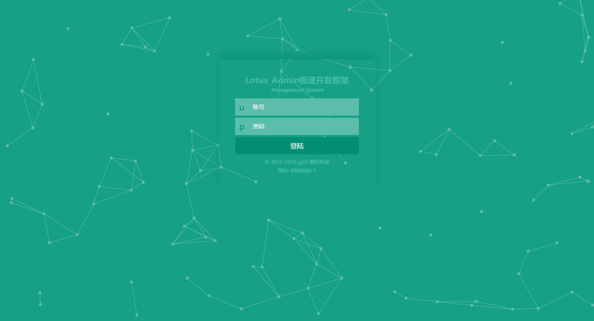
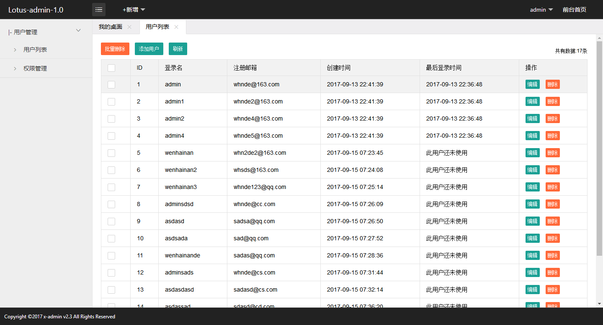
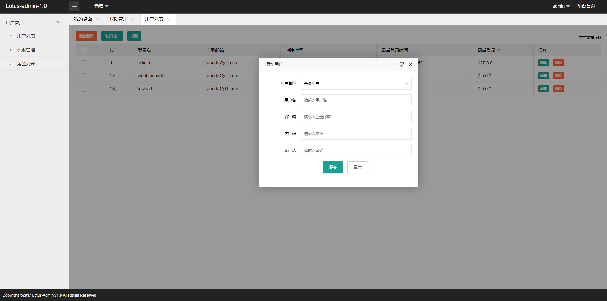

##LotusAdmin是什么?
一个使用thinkphp5.0.11+layui2.0后台开发的极速开发框架

##向thinkphp致敬
* 基于layuui2.0+thinkphp5.0

##LotusAdmin有哪些功能？
* 极简--极简和响应式的高颜值响应式布局，谁说后台都很丑
* 安全--每一个字段都有严格的前后端验证
* 权限--自带后台用户权限
    *  用户管理
    *  节点管理
    *  角色授权
* 导航--前台导航管理

##使用方法
* 导入sql文件
* 账号 admin
* 密码 123456


##有问题反馈
在使用中有任何问题，欢迎反馈给我，可以用以下联系方式跟我交流

* 官方交流群 606645328
* 邮件 whndeweilai@163.com
* 个人QQ: 610176732
* weibo: [@晓野兔子](http://weibo.com/wenhainan)


##部署Linux问题
 * 部署Linux系统的LNMP，需要重写伪静态规则，请按照我的博客教程修改nginx配置 http://www.cnblogs.com/wenhainan/p/7300352.html


##捐助开发者
在兴趣的驱动下,写一个`免费`的东西，有欣喜，也还有汗水，希望你喜欢我的作品，同时也能支持一下。
当然，有钱捧个钱场（下面的捐赠按钮，支持支付宝和微信捐助），没钱捧个人场，谢谢各位


##感激
感谢以下的项目,排名不分先后

* [layui](http://www.layui.com/) 
* [thinkphp](http://www.thinkphp.cn/)
* [xadmin](http://x.xuebingsi.com/)


##关于作者

```javascript
  var wenhainan = {
    nickName  : "闻海南",
    site : "http://www.cnblogs.com/wenhainan/"
  }